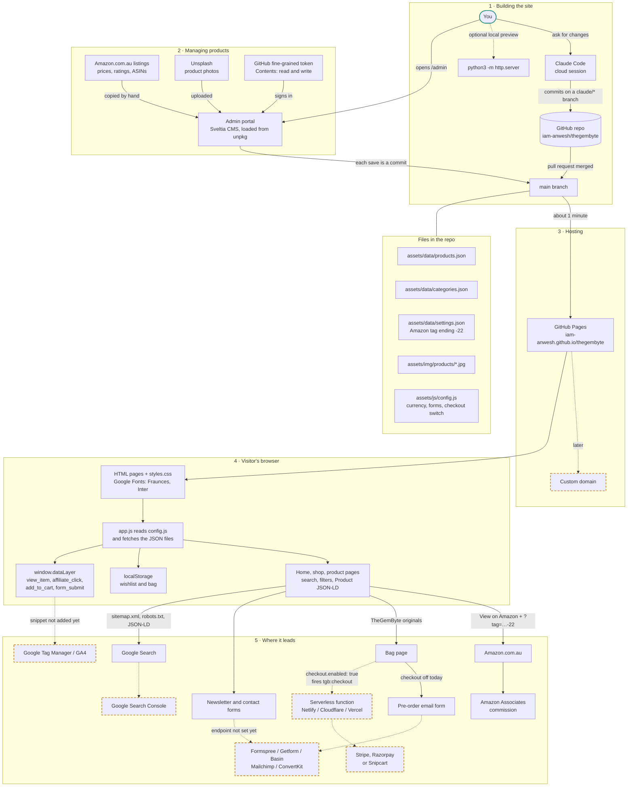

# TheGemByte flowchart

How the project fits together. Solid lines work today; dashed lines and amber boxes are planned and already prepared for in the code.

```mermaid
flowchart TB
  subgraph BUILD["1 · Building the site"]
    YOU(["You"]) -->|ask for changes| CC["Claude Code<br/>cloud session"]
    CC -->|commits on a claude/* branch| GH[("GitHub repo<br/>iam-anwesh/thegembyte")]
    GH -->|pull request merged| MAIN["main branch"]
    YOU -.->|optional local preview| PY["python3 -m http.server"]
  end

  subgraph CONTENT["2 · Managing products"]
    AMZL["Amazon.com.au listings<br/>prices, ratings, ASINs"] -->|copied by hand| ADMIN
    UNS["Unsplash<br/>product photos"] -->|uploaded| ADMIN
    YOU -->|opens /admin| ADMIN["Admin portal<br/>Sveltia CMS, loaded from unpkg"]
    PAT["GitHub fine-grained token<br/>Contents: read and write"] -->|signs in| ADMIN
    ADMIN -->|each save is a commit| MAIN
  end

  subgraph DATA["Files in the repo"]
    PJ["assets/data/products.json"]
    CJ["assets/data/categories.json"]
    SJ["assets/data/settings.json<br/>Amazon tag ending -22"]
    IMG["assets/img/products/*.jpg"]
    CFG["assets/js/config.js<br/>currency, forms, checkout switch"]
  end
  MAIN --- DATA

  subgraph HOST["3 · Hosting"]
    MAIN -->|about 1 minute| PAGES["GitHub Pages<br/>iam-anwesh.github.io/thegembyte"]
    PAGES -.->|later| DOMAIN["Custom domain"]
  end

  subgraph BROWSER["4 · Visitor's browser"]
    PAGES --> HTML["HTML pages + styles.css<br/>Google Fonts: Fraunces, Inter"]
    HTML --> APP["app.js reads config.js<br/>and fetches the JSON files"]
    APP --> SHOP["Home, shop, product pages<br/>search, filters, Product JSON-LD"]
    APP --> LS["localStorage<br/>wishlist and bag"]
    APP --> DL["window.dataLayer<br/>view_item, affiliate_click,<br/>add_to_cart, form_submit"]
  end

  subgraph MONEY["5 · Where it leads"]
    SHOP -->|View on Amazon + ?tag=…-22| AMZ["Amazon.com.au"]
    AMZ --> COMM["Amazon Associates<br/>commission"]
    SHOP -->|TheGemByte originals| BAG["Bag page"]
    BAG -->|checkout off today| PRE["Pre-order email form"]
    BAG -.->|checkout.enabled: true<br/>fires tgb:checkout| FN["Serverless function<br/>Netlify / Cloudflare / Vercel"]
    FN -.-> PAY["Stripe, Razorpay<br/>or Snipcart"]
    SHOP --> FORMS["Newsletter and contact forms"]
    FORMS -.->|endpoint not set yet| FB["Formspree / Getform / Basin<br/>Mailchimp / ConvertKit"]
    PRE -.-> FB
    DL -.->|snippet not added yet| GA["Google Tag Manager / GA4"]
    SHOP -->|sitemap.xml, robots.txt, JSON-LD| SEO["Google Search"]
    SEO -.-> GSC["Google Search Console"]
  end

  classDef planned stroke-dasharray:6 4,stroke:#c0832e,stroke-width:2px;
  classDef person stroke:#2f8f83,stroke-width:2px;
  class DOMAIN,FN,PAY,FB,GA,GSC planned;
  class YOU person;
```
